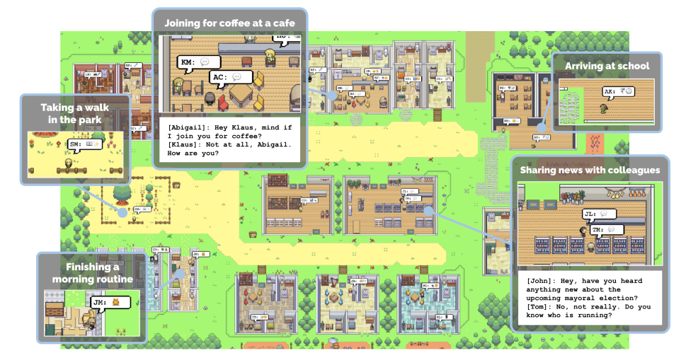

```{r xaringan-themer, include=FALSE, warning=FALSE}
#This block contains the theme configuration for the CSS lab slides style
library(xaringanthemer)
library(showtext)
style_mono_accent(
  base_color = "#5c5c5c",
  text_font_size = "1.5rem",
  header_font_google = google_font("Arial"),
  text_font_google   = google_font("Arial", "300", "300i"),
  code_font_google   = google_font("Fira Mono")
)
```

```{r setup, include=FALSE}
options(htmltools.dir.version = FALSE)
```


layout: true
<div class="my-footer"><span>David Garcia - Online emotions and how to measure them</span></div> 

---

background-image: url(figures/AboutUS.svg)
background-size: 98%

---

layout: true
<div class="my-footer"><span><a href="https://epjdatascience.springeropen.com/articles/10.1140/epjds/s13688-023-00427-0"> LEIA: Linguistic Embeddings for the Identification of Affect. Segun Taofeek Aroyehun, Lukas Malik, Hannah Metzler, Nikolas Haimerl, Anna Di Natale, David Garcia. EPJ Data Science (2023)</a></span></div> 

---
background-image: url(figures/CollectiveEmotionsParis.svg)
background-size: 98%
---

# Challenges in Emotion Identification

```{r, echo=FALSE, out.width=950, fig.align='center'}
knitr::include_graphics("figures/communication.png")
```

Current sentiment analysis approaches assume that the **ground truth** is an annotation of emotions by **a reader**, often a student or a crowdsourcing worker

Noise in ground truth creates **unmeasured error** and potential biases

---

## Vent: Self-annotated Social Media Emotions


<div style="font-size:18pt"><span>Lykousas, N., Patsakis, C., Kaltenbrunner, A., & Gómez. Sharing emotions at scale: The vent dataset. ICWSM (2019)</span></div> 

---

### LEIA: Linguistic Embeddings for the Identification of Affect


---

### Vent and Out-Of-Domain Datasets Summary

| Label        | Train            | Development    | User Test      | Time Test  | Random Test    |
|--------------|:------------------:|:----------------:|:----------------:|:----------------:|:----------------:|
| Sadness      | 1,712,985  | 199,890  | 262,999  | 293,993  | 264,906  |
| Anger        | 1,517,282 | 147,778  | 224,997  | 205,598  | 226,068  |
| Fear         | 1,341,624  | 138,929  | 198,264  | 185,461  | 201,563  |
| Affection    | 979,019    | 144,175  | 161,018  | 191,022| 158,017  |
| Happiness    | 795,363    | 74,369   | 118,290  | 91,127    | 116,647  |
| **Total** | **6,346,273**        | **705,141**        | **965,568**        | **967,201**        |** 967,201 **       |
| | | | | | |


| Dataset | **enISEAR** | **TEC** | GoEmotions | **UniversalJoy** | SemEval |
|---------|:-------------:|:---------:|:----------:|:----------------:|:--------:|
| Source  |Writing Tasks | Twitter #emo    | Reddit    |  Facebook  | Twitter    |
| Year    | 2019    | 2012   |  2020  | 2021   |  2018  |
| N       | 572    |  3,196  |  2,454  |  581  |    1,694  |

---

# Results in Vent

<center>  </center>

LEIA outperforms supervised and unsupervised methods for all emotions and test datsets. $F_1$ values between 70 and 80.

---

# Out-of-domain results

|               | LIWC               | NRC                | NBSVM              | LEIA-base          | LEIA-large         |
|---------------|:--------------------:|:--------------------:|:--------------------:|:--------------------:|:--------------------:|
| Universal Joy | 23.45 | 28.98 | 41.70 | **54.18** | 54.17 |
| GoEmotions    | 45.81 | 32.68 | **48.23** | **46.31** | 45.75 |
| TEC           | 36.02 | 33.92 | 39.07 | 43.87 | **44.12** |
| SemEval       | 66.72  | 49.86  | 68.77 | **71.68** | 70.04 |
| enISEAR       | 23.51 | 42.72 | 55.33 | 70.37 | **79.94** |


- LEIA is best or tied with the best in all out-of-domain tests
- LEIA is best or tied with the best in all emotions except Fear in TEC
- Note: very different media, sampling methods, and labelling schemes

---

# Comparing with GPT models
|           | LEIA-base          | LEIA-large         | GPT-3.5            | GPT-4              |
|-----------|--------------------|--------------------|--------------------|--------------------|
| Affection | 74.48 | **75.67** | 41.38 | 37.43 |
| Anger     | 72.92 | **72.98** | 61.79 | 66.82 |
| Fear      | 69.01 | **70.26** | 51.55 | 60.86 |
| Happiness | **77.69** | 77.58 | 67.69 | 68.70 |
| Sadness   | 67.28 | **68.00** | 59.94  | 64.00 |
| Average   | 72.28 | **72.90** | 56.47 | 59.56 |


- Evaluation on a sample of 1000 texts per emotion label from the user test sample. GPT models used with a standard prompt for zero-shot classification
- LEIA greatly outperforms GPT-3.5-turbo and GPT-4 in each emotion

---

# LEIA (versus) Humans

.center[]
- Students annotating a balanced Vent sample (N=100, 720 annotations)
- Initial results suggest that LEIA is comparable to humans
- **Artificial Affective Intelligence:** Can LEIA help humans read emotions?

---

# Towards (Emotional) Generative Agents

.pull-left[


ABM of collective behavior  
**Problem: calibrating micro-dynamics of agents**
]

.pull-right[
.center[]
[Generative Agents: Interactive Simulacra of Human Behavior. S. Park et al.](https://arxiv.org/pdf/2304.03442)

Can we use LLMs in social simulation?
]

---

## LLM Societies Can Display Complex behavior
.pull-left[.center[]
* LLMs generate scale-free social networks  
* Simulating opinion dynamics with LLMs shows Dunbar scaling with language understanding
]
.pull-right[
]

---
layout: true
<div class="my-footer"><span></span></div> 

---

# Summary

- LEIA to have Affect Identification with valid training data
- LEIA generalizes across users and time
- LEIA outperforms other methods across platforms and domains
- LEIA outperforms GPT models in Vent
- Try LEIA yourself: https://huggingface.co/LEIA/LEIA-base
- Future: LEIA vs Humans and Social Simulation with LLMs 


- <div class="ref"><span><a href="https://epjdatascience.springeropen.com/articles/10.1140/epjds/s13688-023-00427-0"> LEIA: Linguistic Embeddings for the Identification of Affect. S. Aroyehun, L. Malik, H. Metzler, N. Haimerl, A. Di Natale, D. Garcia. EPJ Data Science (2023)</a><br></span></div>
- <div class="ref"><span><a href="https://arxiv.org/abs/2312.06619"> Emergence of Scale-Free Networks in Social Interactions among Large Language Models. G. De Marzo, L. Pietronero, D. Garcia. Arxiv preprint (2023)</a></span></div>
- <div class="ref"><span><a href="https://arxiv.org/abs/2409.02822"> Language Understanding as a Constraint on Consensus Size in LLM Societies. G de Marzo, C. Castellano, D. Garcia. Arxiv preprint (2024)</a></span></div>

.center[**More at: [www.dgarcia.eu](https://dgarcia.eu)**]

---

# A closing call: SG and its members

.center[]

---

# Housekeeping notes

## The audimax needs to be prepared for Prof. Schweitzer's farewell lecture. 

## Please leave the audimax and come to the coffee break. 

## The audimax will be locked until about 4:30.

## You can take your belongings now or you can leave them in the room while it is being prepared.

